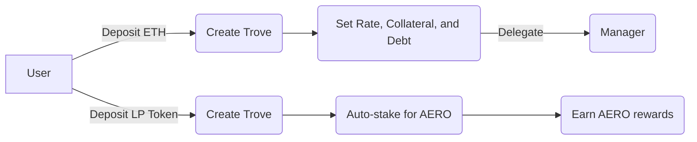

# Borrowing and Liquidations

### What makes borrowing on BaseDollar so unique?

BaseDollar allows users to borrow the stablecoin Base Dollar (BD) with two distinct collateral types:

**Standard Collaterals**: Borrowers can choose and adjust the rate they are willing to pay for their loans (0.5%, 5%, 20%, etc.). Borrowers will establish market rates in accordance with their individual risk tolerance without relying on governance or algorithm rate management.

**LP Token Collaterals**: The contracts support Aerodrome LP-token branches. AeroManager stakes LP collateral in configured gauges and handles AERO rewards. Borrowers still set a BD interest rate, and redeemability is configured per branch.

Each collateral has its own respective borrow market which allows room for a market of rates to develop.

All of this makes for a highly capital efficient, secure and decentralized borrowing experience.

### What is a Trove?

When a borrower deposits collateral, a Trove is created.

A **Trove** is BaseDollar's version of a 'vault'. Each Trove has a particular address owner, and each owner can have multiple Troves.

Each Trove can only have 1 type of collateral deposited in it.

Each Trove allows you to manage a loan, adjusting collateral and debt values as needed. Borrowers set their own interest rate on every branch, including LP-token branches. Trove management can optionally be delegated to a "Manager" with special permissions.

Troves are also transferable NFTs found in the wallet of the owner. Be cautious: transferring the NFT also transfers the ownership of the position.

### What types of collateral can I use on BaseDollar?

BaseDollar works with two types of collateral:

#### Current Configured Collaterals

- **WETH** (90.91% max LTV)
- **wstETH** (83.33% max LTV)
- **rETH** (83.33% max LTV)
- **cbBTC** (90.91% max LTV)
- **cbETH** (83.33% max LTV)
- **AERO** (66.67% max LTV)

#### LP Token Collaterals (Aerodrome Pairs)

The first Aerodrome LP-token collateral branches are coming soon.

:::tip
**LP Token Benefits**:
- Redeemability configured per branch
- Earn AERO rewards while borrowing
- Auto-staking in Aerodrome gauges
- User-set BD interest, with AERO rewards handled separately

See [LP Token Collaterals](/docs/user-docs/lp-token-collaterals) for details.
:::

:::info
New collateral types can be added by governance. Existing ones can be removed, although users will always have the ability to withdraw their positions if a collateral is removed.
:::

### Is there a minimum debt?

Yes, a minimum debt of 200 BD is required for borrowing.

### When do I need to pay back my loan?

Loans issued by the protocol do not have a repayment schedule. You can leave your Trove open and repay your debt any time, as long as you maintain a healthy Loan-to-Value (LTV) Ratio.

### Is there a lockup period?

There is no lockup period. Users are free to withdraw their collateral deposits whenever they want.

As an exception, withdrawals by borrowers are temporarily suspended if the total LTV of a borrow market goes above 75%.

### How do I decide on my LTV?

This depends on your personal preferences, primarily your risk tolerance and how actively you want to manage your position(s).

**Key considerations**:
- **Standard collaterals**: Higher LTV (up to 90.91% for wETH)
- **LP-token branches**: LTV is configured per branch

:::tip
We may display BOLD or BD in graphics borrowed from Liquity documentation.
:::

Please note that these examples are for illustration purposes only and do not represent definitive risk or safety thresholds. It's essential to determine your own risk tolerance and comfort level as a user.

If your LTV becomes too high, your position will be liquidated.

> LTV = Loan to Value. An LTV of 50% means that if you borrowed $100, your collateral is worth $200.

### How do Liquidations work in BaseDollar?

BaseDollar uses oracles (TBD - specific oracle provider) to maintain proper price feeds for our collaterals. Check out the [oracles](/docs/technical-documentation/oracles) section for more info.

Troves get liquidated if the LTV goes above the maximum value for that collateral type.

#### Standard Collateral Liquidations

BaseDollar uses **individual Stability Pools** as the primary liquidation mechanism for standard collaterals. Each borrow-market has its own dedicated Stability Pool earning liquidation gains (in the respective collateral) in exchange for burning debt.

Stability Pool depositors earn the liquidation fees in the liquidated collateral (e.g., ETH, cbBTC).

#### LP Token Liquidations

Each LP-token branch has its own Stability Pool. AeroManager allows LP collateral to remain gauge-staked while protocol pools account for liquidation gains.

#### Fallback Liquidation Mechanisms

Just-In-Time liquidations and redistribution of debt and collateral across borrowers of the same market handle liquidations as a last resort if the Stability Pool is empty.

A liquidated borrower usually incurs a penalty of 5% and will be able to claim the remaining collateral after liquidation.

### How am I compensated for liquidating a Trove?

The liquidation of Troves is connected with certain gas costs which the initiator has to cover. The protocol offers gas compensation:

`0.0375 ETH + min(0.5% trove_collateral, 2_units_of_collateral)`

The `0.0375 ETH` equivalent is funded by a [refundable gas deposit](#what-is-the-refundable-gas-deposit) while the variable `0.5%` part comes from the liquidated collateral, slightly reducing the liquidation gain for Stability Providers.

### What is the max Loan-To-Value (LTV)?

LTV depends on the collateral type you use:

#### Standard Collaterals

| Asset | Max LTV | MCR |
|-------|---------|-----|
| WETH | 90.91% | 110% |
| wstETH | 83.33% | 120% |
| rETH | 83.33% | 120% |
| cbBTC | 90.91% | 110% |
| cbETH | 83.33% | 120% |
| AERO | 66.67% | 150% |

#### LP Token Collaterals

| Type | Max LTV | MCR | Pairs |
|------|---------|-----|-------|
| Coming soon | Branch-specific | Branch-specific | Initial LP pairs will be announced before launch |

:::warning
LP token LTV is lower due to:
- Impermanent loss risk
- Underlying asset volatility
- Pool-specific risks
:::

### What is the refundable gas deposit?

To open a new Trove, the protocol requires a liquidation reserve of 0.0375 ETH (on Base) regardless of the chosen collateral, which is set aside to cover the gas costs of a potential liquidation. The deposit is returned when the Trove is closed by the user (including upon redemptions for standard collaterals).

### How much will I pay for my loan?

Payment depends on your collateral type:

#### Standard Collaterals

On BaseDollar, there are no upfront fees for standard collaterals. Instead, you pay interest on an ongoing basis, making it suitable for short-term loans. When creating a new position or increasing the amount borrowed, borrowers pay the first week of interest up front to prevent arbitrage.

The interest you pay is determined by the rate you set yourself. For example, if you borrow 10,000 BD at a 5% interest rate, you'll pay ~500 BD in interest after one year. This interest is added to your outstanding debt.

#### LP Token Collaterals

LP-token borrowers set a BD interest rate like borrowers in other branches. AeroManager separately stakes LP collateral and handles AERO rewards.

See [LP Token Collaterals](/docs/user-docs/lp-token-collaterals) and [AERO Distribution](/docs/technical-documentation/aero-distribution) for more details.

### What are user-set rates?

On BaseDollar, users set their own interest rates, giving them full control over costs and improving predictability.

User-set interest rates facilitate a capital-efficient equilibrium between BD borrowers and holders in a fully market-driven manner. These rates serve as the primary revenue source for BD holders, generating continuous, sustainable real yield for BD depositors.

Borrowers should set their rates based on their [redemption](/docs/user-docs/redemption-and-delegation#what-are-redemptions) risk tolerance.

### Can I adjust the rate?

Borrowers can adjust their interest rate, subject to the normal branch rules and fees.

Note however, for standard collaterals, a fee corresponding to 7 days of average interest is charged when opening the loan, as well as on any rate adjustments that happen less than 7 days after the last adjustment.

### How do I decide on the right rate for me? (Standard Collaterals)

Setting an interest rate determines your redemption risk and needs to be aligned with your goals and how actively you want to manage your position.

A branch registered as non-redeemable is excluded from normal redemptions; LP collateral alone does not determine that setting.

Users can also decide to delegate interest rate management to a third party, who can set your interest rate and charge a fee for this service.

By opting to manage your own rate, you will have to weigh the savings from a lower rate against the higher redemption risk and increased adjustment frequency with potential additional costs.

Since redemptions are performed in ascending order of interest rate (for the respective collateral asset), you will typically want to keep a buffer of other borrowers with lower rates in front of you.

### What could the average interest rate be?

These will be set continuously by the market and will vary over time.

Given that 75% of the interest revenue is paid out to BD Stability Pool depositors, we expect that stablecoin deposit yields should be competitive with or higher than other platforms.

### What determines the riskiness of my Trove?

There are two to three key parameters to consider:

#### For Standard Collateral Troves

* **Loan-to-value (LTV)**: Based on your debt-to-collateral ratio and affects your risk of [liquidation](#how-do-liquidations-work-in-based).
* **Interest rate (IR)**: You set this rate yourself, and it influences your risk of being [redeemed](/docs/user-docs/redemption-and-delegation#what-are-redemptions).

#### For LP Token Troves

* **Loan-to-value (LTV)**: Based on LP token value and affects liquidation risk
* **Impermanent Loss**: LP tokens subject to IL based on underlying assets
* **Redemption Setting**: Configured per branch

You have flexibility to set these parameters as you see fit, allowing you to control the relative riskiness of each Trove. You can create multiple Troves under the same address, enabling different risk profiles for different portions of your portfolio.

### Are there any other fees related to borrowing?

**Standard Collaterals**: A "premature adjustment fee" is charged on interest rate changes that happen within less than 7 days since the last adjustment (or the opening of the Trove). The fee equals 7 days of average interest on the respective borrow market. The same fee is charged when a new Trove is opened or when its debt is increased.

**LP Token Collaterals**: Use the same interest-rate adjustment model as other branches.

### How many Troves (loans) can I open with the same address?

You can have multiple open Troves for the same collateral or across different collateral types, all represented as separate NFTs.

Mix and match:
- Multiple ETH Troves with different rates
- LP token Troves for different pairs
- Combination of standard and LP collaterals

### Are Troves transferable?

Yes, they are represented as NFTs (ERC-721), hence easily transferable between wallets. When you send the NFT you also send full access to your Trove and all the funds within it.

Please note that selling Troves on secondary markets comes with inherent risks, and caution is advised.

### How do I loop my exposure?

Looping allows you to borrow BD against your deposited collateral and use it to buy more collateral, increasing your exposure to the underlying asset. BaseDollar has built-in automation to achieve this with one click (zappers).

**LP Token Note**: Looping LP positions requires buying more LP tokens with borrowed BD, then depositing them as additional collateral.

Make sure you choose a frontend that supports this functionality, and be mindful of liquidity/slippage.

### How are collateral risks mitigated?

BaseDollar has separate borrow markets for each collateral type with their own liquidation mechanisms:

**Standard Collaterals**:
- Individual Stability Pools for efficient liquidations
- User-set interest rates
- Subject to redemptions
- LTV factors per asset

**LP Token Collaterals**:
- Segregated branches with capped debt limits
- Individual Stability Pool for each LP branch
- Redeemability configured per branch
- Branch-specific collateral ratios

Risks are mitigated through:
- Temporary borrowing restrictions in times of low collateralization
- Redemption logic prioritizing under-backed collateral across redeemable branches
- Collateral shutdown as emergency measure
- Segregation of LP token branches

Keep in mind that despite all these measures, BaseDollar remains dependent on the supported collateral assets and there is no strict guarantee that it remains overcollateralized in case of a sudden collapse of a collateral asset.

### How does the system compartmentalize risk among different collateral types?

This depends on the party in question:

* **Borrowers**: Collateral risk is limited to the collateral asset held by the borrower. A borrower isn't negatively affected by failure of another collateral asset.
* **BD Holders**: As a multi-collateral stablecoin, BD is reliant on effective liquidations of undercollateralized loans in every borrow market to remain overcollateralized. Holders are subject to the risks of all supported collateral assets.
* **Earners**:
  - Individual SP depositors get exposure only to their chosen asset
  - All earners are BD holders and subject to potential depegging

### What mechanisms are in place if the Stability Pool is empty?

If the branch Stability Pool doesn't cover the full debt and gets completely emptied by liquidation, the system falls back to:

The liquidator can freely choose between two fallback liquidation modes for the debt exceeding the funds in the pool:

1. **Just-in-time (JIT) liquidation**: The liquidator sends an amount of BD corresponding to the (remaining) debt in exchange for 105% of its nominal value in the collateral asset.
2. **Redistribution**: The liquidator triggers a redistribution, through which the Trove's entire debt and collateral is redistributed to all fellow borrowers of the respective collateral market, in proportion to their own collateral amounts.

### Shutdown Borrow Markets

The system may shut down borrow markets whose total collateralization ratio (TCR) falls below the minimum threshold for each collateral type. The shutdown is performed by incentivizing redemptions against the respective collateral (urgent redemptions remain available directly through the shut-down branch).
